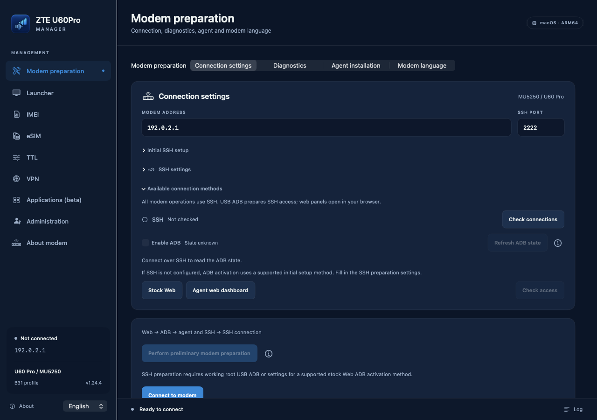
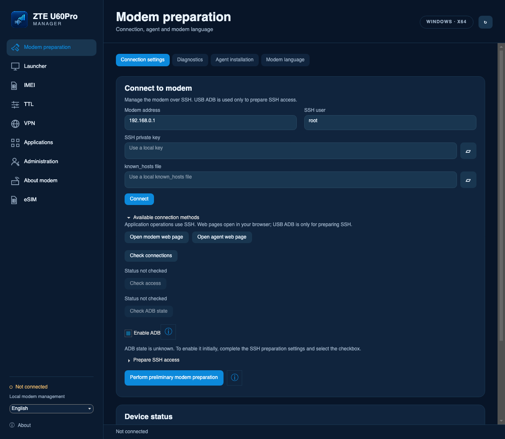
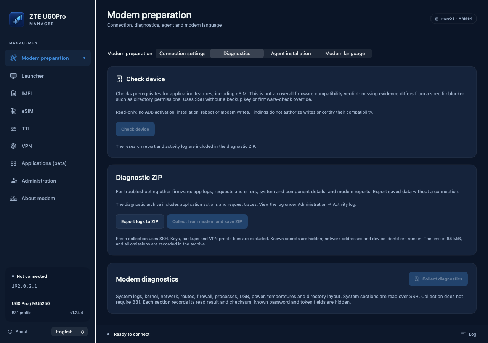
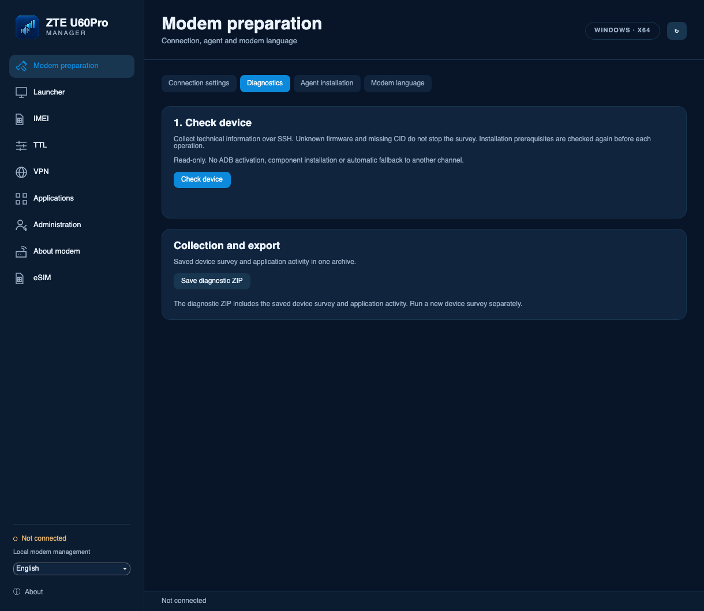
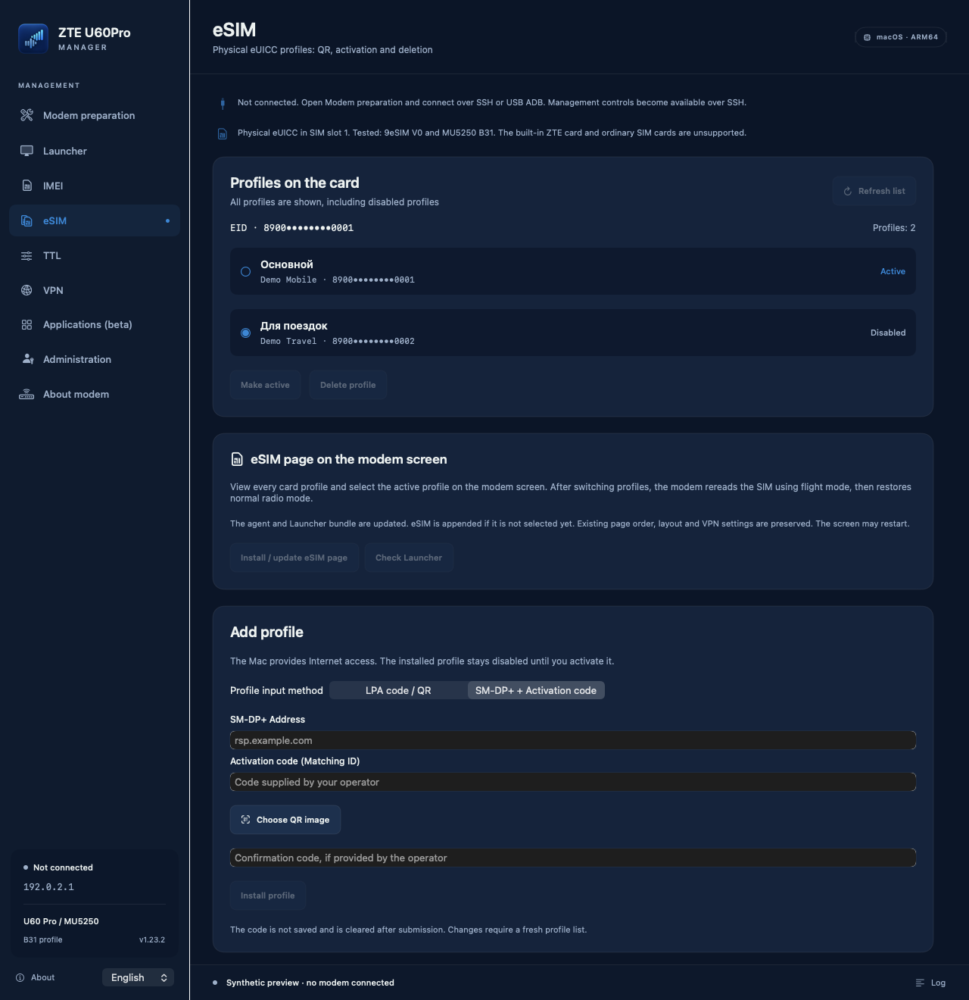
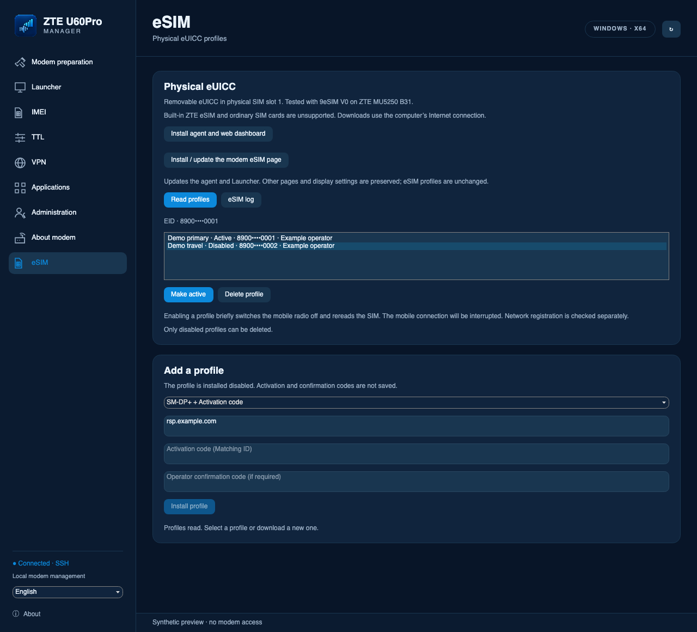
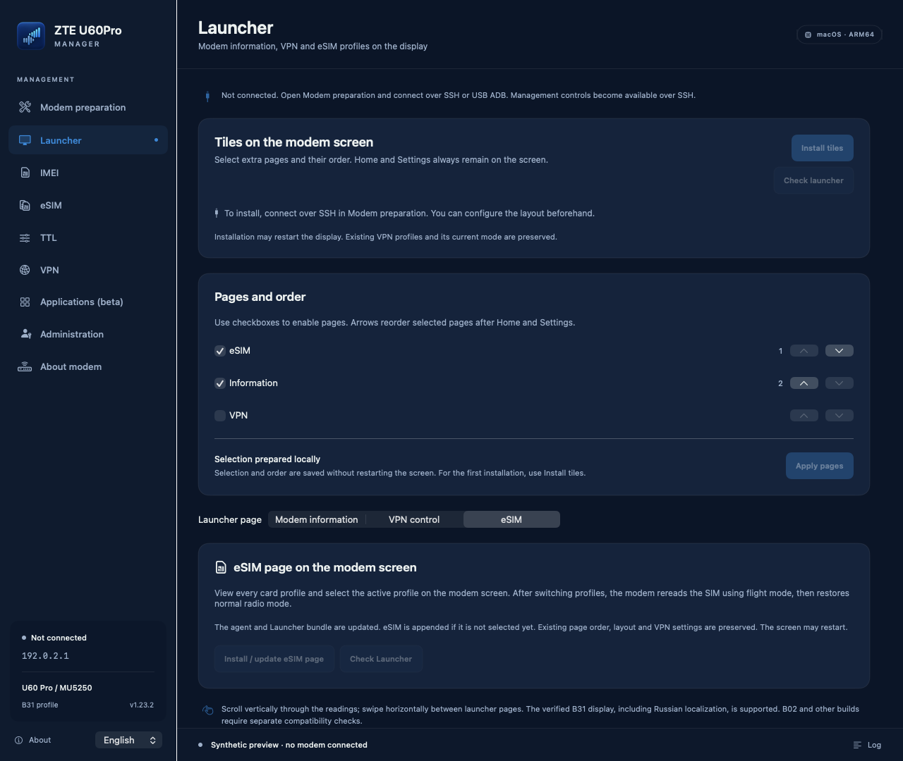
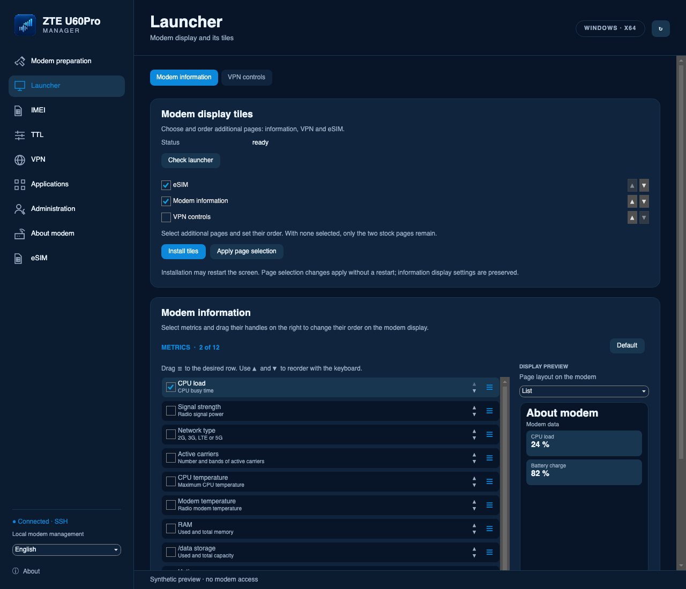
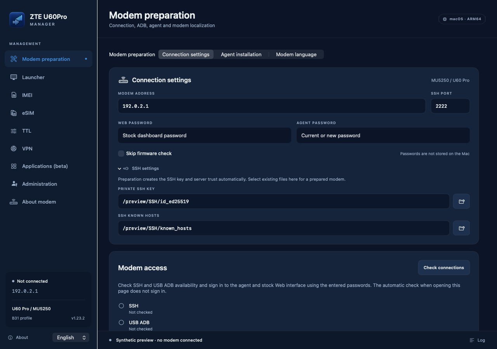
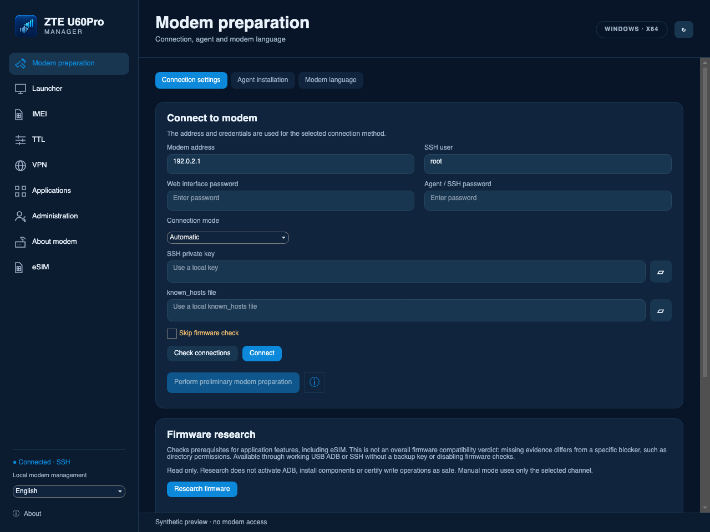

# ZTE U60Pro Manager — desktop apps and modem agent

**English** · [Русский](README.ru.md)

Manage the **ZTE U60 Pro / MU5250**: access preparation, backups, IMEI, TTL,
Russian screen localization, VPN over a separate Wi-Fi network, removable
physical eUICC cards, and diagnostics.

Version **1.24.9** (macOS build **50**, Windows FileVersion **1.24.9.0**),
agent **2.9.0-esim.4**. [Changes and verification limits](docs/RELEASE-1.24.9.md).

The release package is in `dist/1.24.9`.
[Preparation details and limits](docs/PREPARATION-1.24.7.md).

## Local candidate 1.24.13

The global agent diagnostic mode and its extra installation/status checks have
been removed. Firmware research runs in the desktop application over SSH.
Agent operations validate their own requirements.

Exact B31 and FLY B28 profiles are included for Russian screen localization and
Launcher pages. Windows agent installation and independent SSH tools use the
actual platform and component requirements. **Collect firmware adaptation data**
now combines up to 40 component files, 57 fresh probes and sanitized activity.
[Changes and remaining checks](docs/RELEASE-1.24.13.md) ·
[Collection instructions](docs/FIRMWARE-ADAPTATION-DATA.md).
Full B28 operation, including VPN/TTL and modem writes, is not yet verified.

## Changes since published version 1.23.3

- Faster SSH control: two short requests on connection; agent, VPN, screen, and
  other components are checked on demand.
- Preparation uses observed device capabilities, with fixes for legacy ADB
  responses and long commands. Each operation checks the components it needs.
- **Clean installation after a factory reset** beside the preparation button:
  reinstall the agent and SSH with a new password, back up components, and verify
  the downloaded archive before cleanup. The **ⓘ** button explains its scope.
- Recovery of VPN and extra screen-page services after a reset, better VPN error
  handling on the modem screen, and specific screen-localization failures.
  Independent actions are not blocked by unrelated preparation or IMEI journals.
- Ordinary SIM and physical eUICC classification uses a verified card read;
  an error alone does not identify an ordinary SIM. Card checks stay on the
  dedicated eSIM page. The built-in ZTE eSIM is not supported.
- Unified diagnostics under Preparation: a single ZIP includes the saved device
  report and redacted application activity. **Skip firmware version check** is
  available again; each operation retains its own checks.

## Overview

The project includes two desktop applications and a standalone modem agent:

| Component | Platform | Purpose |
| --- | --- | --- |
| **ZTE U60Pro Manager** | Apple Silicon Mac, macOS 13+ | Modem preparation, component installation and updates, IMEI, TTL, backups, eSIM, and diagnostics |
| **ZTE U60Pro Manager Windows** | Windows x64 | Self-contained portable package: prepare SSH through ADB, manage the modem over SSH, Launcher, VPN, applications, Terminal, IMEI, eSIM, and backups |
| **ZTE Agent** | Linux ARM64 on the modem | RU/EN web dashboard, modem and network status, VPN profile selection and import, and physical eUICC management; downloading a profile requires the modem's internet connection |

### Tested system

| Item | Verified value |
| --- | --- |
| Modem | **ZTE U60 Pro / MU5250** |
| Firmware | **CN_ZTE_MU5250V1.0.0B31** |
| Inner firmware | **BD_CNMU5250V1.0.0B31** |
| Modem platform | Linux ARM64 |
| Physical eUICC | Removable **9eSIM V0** in the SIM slot was tested previously; the built-in ZTE eSIM is not supported |

On this B31 device, checks for 1.24.9 on **6 October 2026** covered a clean installation after a
user-performed factory reset, authentication with the new agent password, SSH on
port 2222, a verified component backup, and restored Russian screen localization.
One connection test took about **0.72 seconds**; this is an observed result, not a
connection-time guarantee. B28 hardware and native Windows execution have not
been tested. The B31 results do not establish compatibility of every feature with
other firmware versions.

**[Download the applications and agent](https://github.com/SadykovIV/ZTE_U60Pro/releases/latest)** ·
[Application guide](docs/APPLICATION.md) · [Agent guide](docs/AGENT.md) ·
[Build from source](docs/BUILD.md)

The interface supports Russian and English. The application was developed with
support from [uFactor](https://usergate.com/ufactor), the expert division of
[UserGate](https://usergate.com).

## Screenshots

### Diagnostics

In the current interface, **Modem preparation → Diagnostics** is a single page
for device checks, firmware research, and export. Connection methods are grouped
in a compact disclosure section on the **Connection** tab. The activity log stays
under Administration, and diagnostic utilities stay under Applications.

The following screenshots show the earlier **macOS build 42 / Windows 1.24.4.1**
candidate:

| macOS · 1.24.4 build 42 | Windows UI · 1.24.4.1 |
| --- | --- |
|  |  |
|  |  |

These images were rendered by the application with separate synthetic data. The
Windows UI was tested on macOS; these screenshots do not demonstrate execution
on Windows. [RU/EN screenshots and their sources](docs/images/README.md#подключение-и-единая-диагностика-1244-build-42).
Screenshots of the earlier **build 41**, with three diagnostic groups, are
[preserved as history](docs/images/README.md#диагностика-1244).

The eSIM, Launcher, and connection images below are retained from 1.23.2.

### eSIM

Install a profile from a QR code or LPA string, or use separate **SM-DP+ Address**
and **Activation code** fields. View profiles and select the active one. This
requires a **removable physical eUICC in the SIM slot**; 9eSIM V0 has been tested.
The built-in ZTE eSIM is not supported by this release.

| macOS | Windows UI |
| --- | --- |
|  |  |

### Modem screen pages

Use checkboxes to select Information, VPN, and eSIM pages; use the arrows to
change their order.

| macOS | Windows UI |
| --- | --- |
|  |  |

Connection and modem preparation

| macOS | Windows UI |
| --- | --- |
|  |  |

These are real application screens with demonstration data. The Windows UI was
rendered through Avalonia on macOS; this is not a Windows runtime test.
[All RU/EN screenshots and provenance](docs/images/README.md).

## Modem requirements

### Sources and acknowledgments — read before installation

Development draws on the following ZTE projects and materials. Linking to a
source does not imply that its authors endorse this build.

1. **[jesther-ai/open-u60-pro](https://github.com/jesther-ai/open-u60-pro)** — original U60 Pro research, APIs, device access, and agent foundation. Author: **Jesther Silvestre**. Backup key discussion: **[issue #8](https://github.com/jesther-ai/open-u60-pro/issues/8)**.
2. **[dklasens/MU5250-OpenUI](https://github.com/dklasens/MU5250-OpenUI)** — foundation for the Rust agent, web dashboard, safe process execution, and device preparation. Author: **David Klasens**. Based on **[v2.4](https://github.com/dklasens/MU5250-OpenUI/releases/tag/v2.4)**, commit `fabaf8b53678dc50e3c3fa2fa3de8b51061967cc`; the ADB preparation protocol was cross-checked against **[zunlock.py](https://github.com/dklasens/MU5250-OpenUI/blob/v2.4/scripts/zunlock.py)**. MIT notices are retained.
3. **[4PDA: ZTE U60 Pro MU5250 5G](https://4pda.to/forum/index.php?showtopic=1108605)** — modem discussion thread. A specific SSClash installation procedure from this thread has not been verified; our installer is not presented as a copy of a forum solution.
4. **[OpenWrt 23.05.4](https://downloads.openwrt.org/releases/23.05.4/)** — Dropbear and uhttpd packages, plus UCI/ubus and network service documentation. [Full dependency, version, and license list](THIRD_PARTY_NOTICES.md).
5. VPN uses **[MetaCubeX/Mihomo v1.19.31](https://github.com/MetaCubeX/mihomo/tree/v1.19.31)**. **[SSClash-Go](https://github.com/zerolabnet/SSClash-Go)** is a separate optional application. It is not currently in the verified catalog, and its executable is not included in the published package.
6. eSIM uses **[estkme-group/lpac v2.3.0](https://github.com/estkme-group/lpac/tree/c2fcf5e4b21c712d54e35a11da2ad9ad134fb821)** with pinned stdio patches. [eSIM component builds](third_party/ESIM-SOURCES.md), [licenses](THIRD_PARTY_NOTICES.md).

The NV550/EFS format, B31 firmware restrictions, Russian screen localization, and
screen page integration were also researched on our own device. A locally
provided tool, “ZTE U60 Pro (MU5250) — Professional Device Manager”, was used as
an API reference. Its author and original source could not be established, so
its code and archive are not distributed here. ZTE firmware, complete stock UI
executables, and device dumps are not published.

### Verified configuration

- **ZTE U60 Pro / MU5250**, firmware **CN_ZTE_MU5250V1.0.0B31**.
- Linux ARM64 on the modem. Additional packages use the OpenWrt **23.05.4** base,
  `aarch64_cortex-a53`; this does not replace the firmware with OpenWrt.
- Access to the modem's local network; its default address is **192.168.0.1**.
- A new SSH installation requires root USB ADB and a password for the new agent.
  Enabling ADB through the stock web interface requires its password. Existing
  working SSH can be reused without installing the agent. Preparation checks
  working SSH, root USB ADB, stock USB debug through the web interface, and the
  backup method, in that order. The known platform key is tested against a fresh
  archive regardless of the firmware name; restore is allowed only after the
  archive and stock USB boot block are validated. **Backup-key suffix** is an
  optional manual override; an incorrect supplied value stops preparation.
  Owner passwords and SSH trust are configured for the owner's device.
- Stable power and free space in `/data`; the installer checks the required space.
- VPN uses the guest interfaces on both Wi-Fi bands. Mesh and conflicting
  third-party proxies must be disabled; TTL/VPN require the software packet path.

Earlier and other MU5250 firmware versions use the same preparation sequence.
Available root USB ADB allows SSH installation to be assessed against the actual
Linux ARM64 environment. IMEI, radio cycling, and screen extension compatibility
are checked separately; successful preparation does not verify those features.

**Modem changes are made at your own risk. Data loss and device damage are
possible.** Full hardware validation of other firmware versions is not complete.
The application offers a firmware-check override with a warning; it resets when
the application closes. NV/EFS structure, backup integrity, and exact screen
extension compatibility checks remain enabled.

## Check the device before installation

After connecting over SSH, open **Modem preparation → Diagnostics → Check device**.
Normal firmware research and fresh diagnostics use SSH. A connection failure does
not trigger a fallback to ADB, the web interface, or the agent API. Unknown
firmware alone does not prevent reading. The report includes technical facts,
sources, missing observations, and failure reasons, and can be exported as ZIP.
Incomplete identification is marked separately and does not authorize installation.

If SSH is not yet available, the separate access preparation flow uses root USB
ADB and an internal device survey before installation. Its selected USB device
and identity checks remain in place; ordinary diagnostics do not bypass them.

Access installation rechecks the current device. With working root USB ADB,
SSH and the agent can be prepared without the stock web API. This
installer supports an observed Linux ARM64 environment with a verified `/data`
layout, Dropbear, and startup through procd/rc.local. Other environments can still
be surveyed but need an appropriate installer. Firmware research belongs to the
desktop application over SSH. The agent provides information and controls for
its web panel and modem pages. Each operation checks its required components;
there is no global diagnostic mode. IMEI, eSIM, Launcher, VPN, and restore
compatibility are checked separately.
[Contract and verification limits](docs/DEVICE-DISCOVERY-CONTRACT.md).

General diagnostic actions share one **Diagnostics** page without additional
tabs. Connection checks and the ADB checkbox are under **Connection → Available
connection methods**. About the modem retains information and memory views. The
activity log remains under Administration alongside access and backups, and the
global log shortcut still opens it. Diagnostic utilities remain under
Applications. eSIM card checks and VPN actions stay on their own pages.

On Windows, **Save diagnostic ZIP** exports saved device information, application
actions, and redacted traces. Start a fresh device survey separately with
**Check device**. The persistent Windows journal starts with 1.24.4; actions from
closed sessions of older versions cannot be recovered.
[Build checks and limits](docs/RELEASE-1.24.4.md#проверки-и-границы).

### USB ADB checkbox

**Enable ADB** reads and changes state through SSH only on the verified B31/configfs
configuration. It changes the ADB function link and checks the other USB functions
before and after the operation. USB connectivity, including networking, may be
interrupted briefly. Without SSH confirmation, the modem attempts to restore the
original state after 60 seconds; an unknown outcome blocks another write. The
change lasts until reboot and does not alter startup settings. Unknown state is
shown separately from disabled state. This is a limited adapter, not a promise of
universal ADB switching on every firmware version.

## Quick start

1. Download the ZIP for your OS from Releases. On Mac, open the `.app`. On Windows, extract the entire archive and run `ZTE U60Pro Manager.exe`, keeping the `Resources` folder alongside it. No separate .NET installation is needed; USB ADB may require a modem driver.
2. Open **Modem preparation → Connection** and connect over SSH. If SSH is not configured, use the separate preparation action: working root USB ADB first; otherwise, stock USB debug through the web interface, followed by the verified backup method. Web methods require the stock web password; the manual backup key is optional. The SSH key is created on the computer, and device binding is checked over USB. Working SSH does not require preparation again. All ordinary application operations use SSH; Web and Agent buttons open a browser. Once connected, save a device survey through **Diagnostics → Check device**. [Methods, commands, and recovery after interruption](docs/ADB-PREPARATION.md).
3. Save a backup before making changes. IMEI operations create their mandatory backup automatically.
4. Install the components you need. Use **VPN** for VPN components and enter profiles **in the agent web dashboard**. Install and configure screen pages in **Launcher**. The verified catalog includes htop and experimental opkg; its list is updated separately from GitHub. Terminal opens an SSH session automatically. Installed applications outside the catalog can also be removed.
5. For eSIM, insert a physical eUICC, select the physical SIM slot, and request profiles on the **eSIM** page. Profile downloads through the desktop app use the computer's internet connection; downloads through the web dashboard use the modem's connection. [Details and limitations](docs/ESIM-DESKTOP.md).
6. Open the agent with the application's button or at `http://192.168.0.1:8080`. The API uses port **9090**. Set the agent password during preparation; the build has no shared agent password.

After a factory reset, select **Clean installation after a factory reset** beside
the preparation button and enter a new agent password in the initial SSH
preparation settings. This reinstalls the agent and SSH and cleans only
application components after archiving them. To reinstall without component
cleanup, use the separate **Forced preparation: reinstall the agent and SSH**
checkbox. Components are backed up before replacement. SSH uses port 2222 and the
private `/data/zte-imei-studio` directory; verified keys are preserved. Once
completion is confirmed, known temporary files from completed installations are
removed. Unverified uploads, foreign files, backups, and journals are retained.
During explicit clean installation, an earlier ready installation can be
finalized after its device, files, process, and backup are verified; its journal
is preserved. Unfinished changes are not replayed automatically, and an
unconfirmed rollback does not authorize another write. Stock modem data, IMEI,
and SIM/eSIM profiles are not cleared.

The Mac application is **ad-hoc signed** and is not notarized by Apple. If macOS
blocks it, use Open or **Privacy & Security → Open Anyway** for the verified file
you downloaded. Do not disable Gatekeeper globally. The Windows EXE is not
certificate-signed; checksums are in `SHA256SUMS`.

## Repository contents

- `MacIMEI/` — SwiftUI sources, modem C helpers, installers, and tests.
- `Windows_x64/` — Avalonia/.NET sources, resources, tests, and Windows build scripts.
- `ModemAgent/` — Rust agent, VPN controller, React dashboard, and launcher extension.
- `Catalog/` — signed catalog of verified applications; `Branding/` — the icon and its creation notes.
- `docs/` — usage and build documentation; `tools/` — dependency preparation, releases, and audits.

The repository contains no personal SSH keys, owner logins, backups, working VPN
profiles, servers, or device-specific configurations. Test values and
`example.com` are synthetic; test profiles are never installed. Standard system
names such as `root` remain where required by the protocol. Authors' names and
original project URLs are retained for attribution.

## Licenses and verification limits

Original code and derivatives of MIT projects use the [MIT license](LICENSE),
with upstream notices retained. Dependencies have their own licenses, including
GPLv3 for Mihomo, AGPLv3 for lpac, and LGPLv2.1 for libeuicc; see
[THIRD_PARTY_NOTICES.md](THIRD_PARTY_NOTICES.md).

Baseline features were tested on B31. The public build is rebuilt after
sanitization and checked with local tests. Changes to network naming and key or
SSClash acquisition do not constitute new validation on every firmware version.
The diagnostic ZIP helps investigate compatibility, but review it before sharing:
automatic redaction cannot recognize every unknown form of personal data.

Windows has been checked through builds, synthetic tests, and Avalonia UI tests.
Execution on a physical Windows system and modem installation from Windows have
not been verified. Windows can create and verify full eMMC images but cannot
restore them. macOS restore requires a separate recovery environment; no image
of that environment is included in the release. Full snapshots of a running
system are not atomic and do not include RPMB/OTP.
