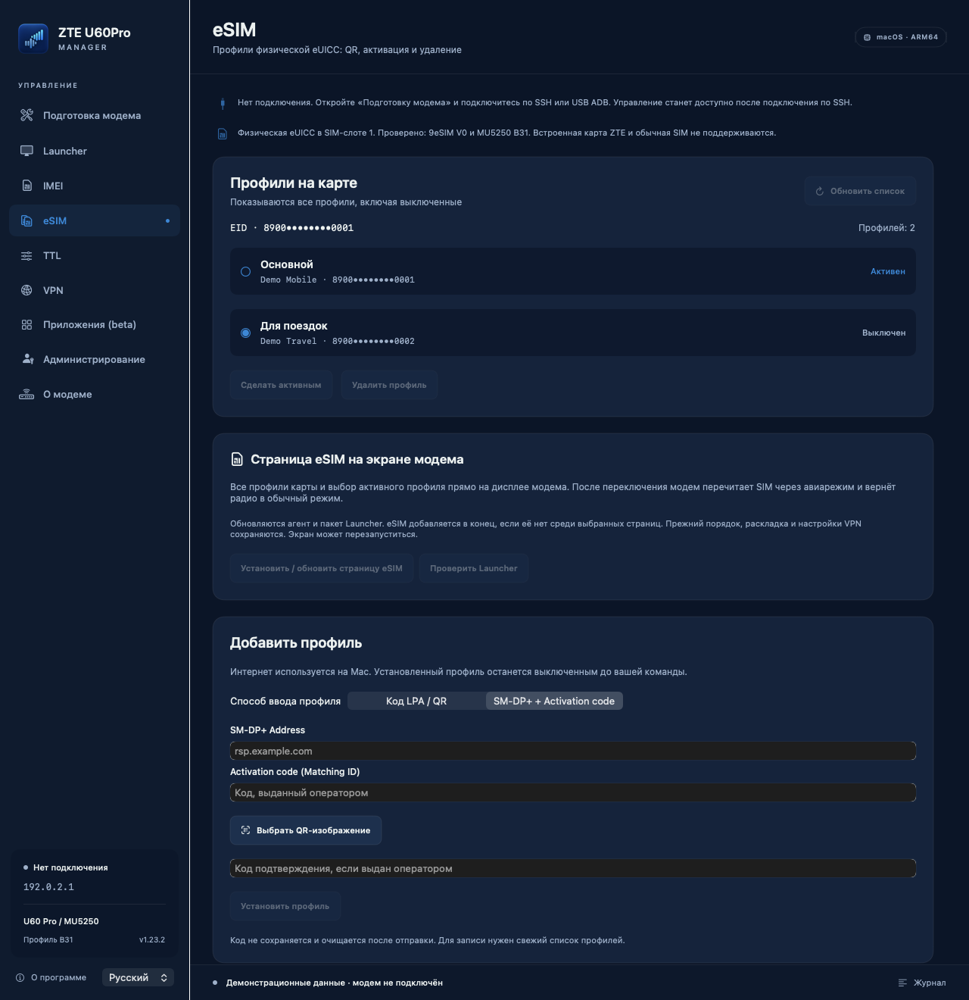
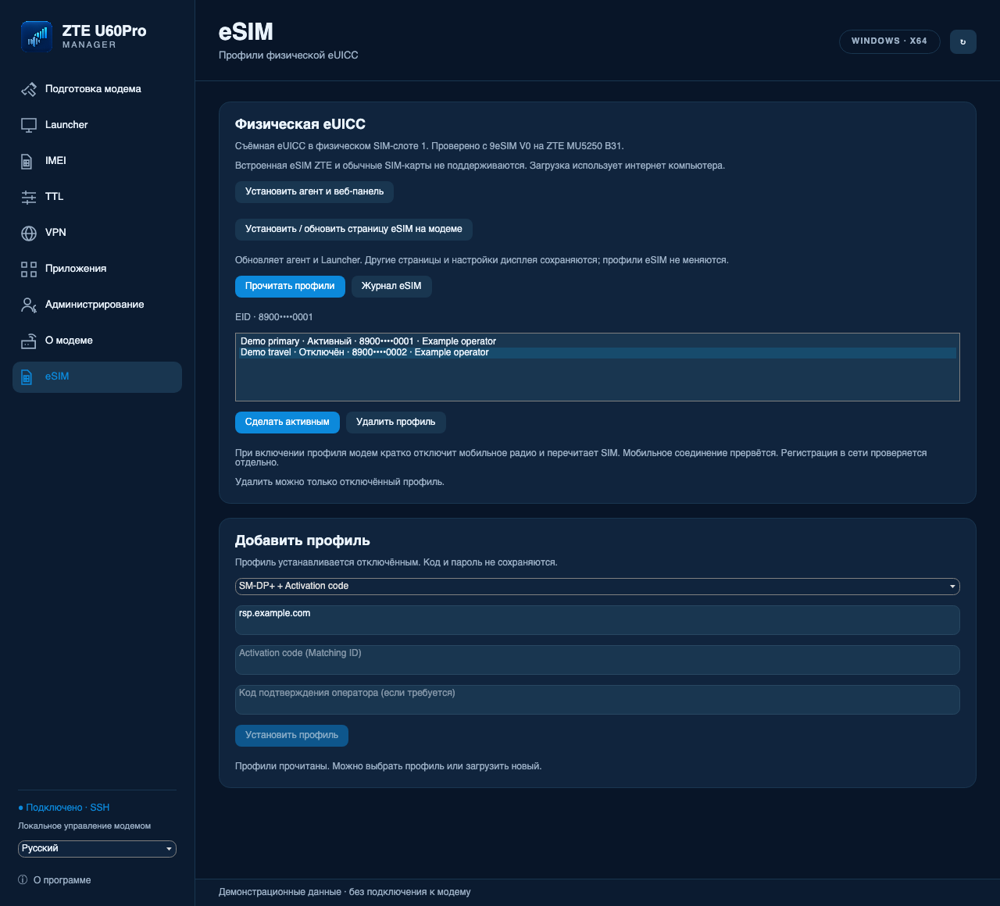
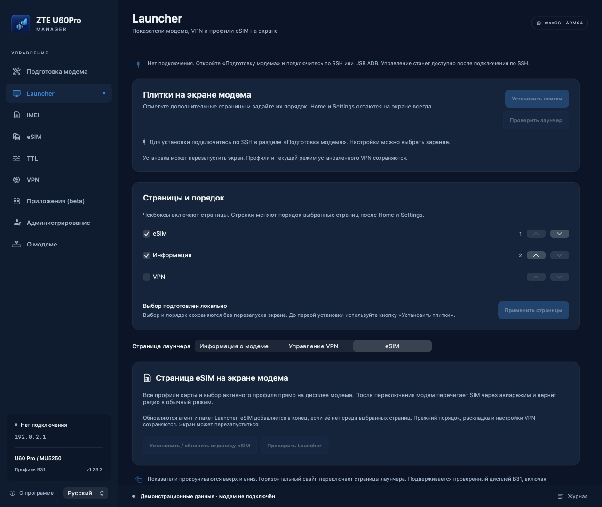
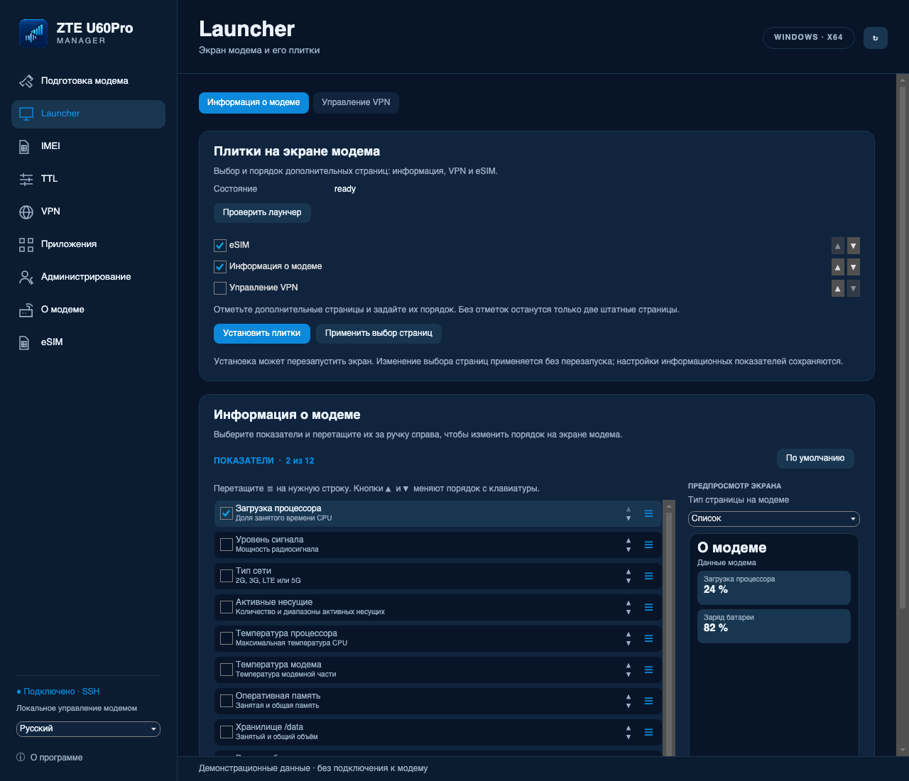
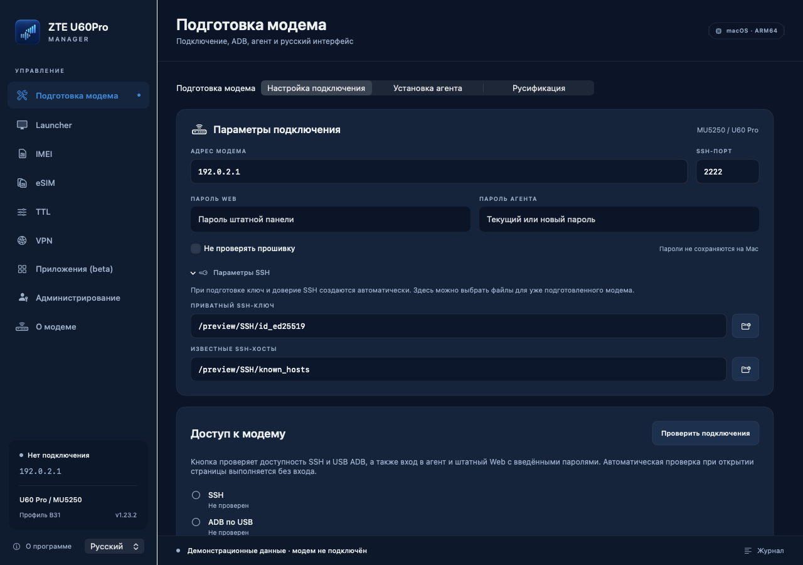
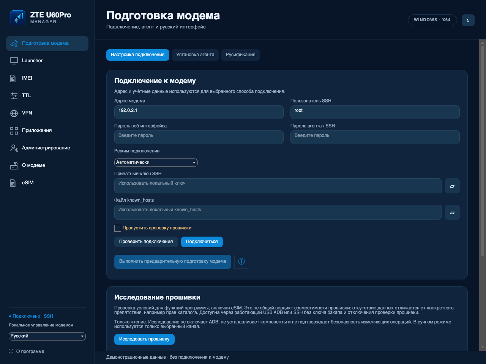

# ZTE U60Pro Manager — приложение и агент

Управление **ZTE U60 Pro / MU5250**: подготовка доступа, резервные копии, IMEI, TTL,
русский интерфейс экрана, VPN через отдельный Wi-Fi, физическая eUICC и диагностика.

Текущий выпуск: **1.23.2**, агент **2.7.0-esim.8** (ветка eSIM). [Изменения относительно 1.20.0](docs/RELEASE-1.23.2.md).

В проекте приложения для двух платформ и самостоятельный агент:

| Компонент | Где работает | Для чего нужен |
| --- | --- | --- |
| **ZTE U60Pro Manager** | Mac с Apple Silicon, macOS 13+ | Подготовка модема, установка и обновление компонентов, IMEI, TTL, бэкапы, eSIM и диагностика |
| **ZTE U60Pro Manager Windows** | Windows x64 | Самодостаточный portable-комплект: подготовка, SSH/ADB, Launcher, VPN, приложения, Terminal, IMEI, eSIM и резервные копии |
| **ZTE Agent** | На самом модеме, Linux ARM64 | Веб-панель RU/EN, состояние модема, сеть, выбор и импорт VPN-профилей; управление физической eUICC; для загрузки профиля нужен интернет модема |

**[Скачать программу и агент](https://github.com/SadykovIV/ZTE_U60Pro/releases/latest)** ·
[Описание программы](docs/APPLICATION.md) · [Описание агента](docs/AGENT.md) ·
[Сборка из исходников](docs/BUILD.md)

Интерфейс доступен на русском и английском. Приложение разработано при поддержке
экспертного подразделения [uFactor](https://usergate.com/ufactor) компании [UserGate](https://usergate.com).

## Скриншоты

### eSIM

Установка из QR или LPA-строки, отдельные поля **SM-DP+ Address** и **Activation code**, список профилей и выбор активного. Нужна **съёмная физическая eUICC в SIM-слоте**; проверена 9eSIM V0. Встроенная eSIM ZTE этим выпуском не поддерживается.

| macOS | Windows UI |
| --- | --- |
|  |  |

### Страницы экрана модема

Галочками выбираются «Информация», VPN и eSIM; стрелки задают порядок страниц.

| macOS | Windows UI |
| --- | --- |
|  |  |

Подключение и подготовка модема

| macOS | Windows UI |
| --- | --- |
|  |  |

Снимки настоящего интерфейса с демонстрационными данными. Windows UI отрисован через Avalonia на macOS; это не проверка запуска в Windows. [Все скриншоты RU/EN и сведения об их происхождении](docs/images/README.md).

## Требования к модему

### Источники и благодарности — прочитайте до установки

Разработка опирается на следующие проекты и материалы по ZTE. Ссылки на источники
не означают поддержку этой сборки их авторами.

1. **[jesther-ai/open-u60-pro](https://github.com/jesther-ai/open-u60-pro)** — исходное исследование U60 Pro, API, доступ к устройству и основа агента. Автор: **Jesther Silvestre**. Обсуждение ключа резервного копирования: **[issue #8](https://github.com/jesther-ai/open-u60-pro/issues/8)**.
2. **[dklasens/MU5250-OpenUI](https://github.com/dklasens/MU5250-OpenUI)** — основа Rust-агента, веб-панели, безопасного запуска процессов и процедуры подготовки устройства. Автор: **David Klasens**. Использована база **[v2.4](https://github.com/dklasens/MU5250-OpenUI/releases/tag/v2.4)**, commit `fabaf8b53678dc50e3c3fa2fa3de8b51061967cc`; протокол ADB-подготовки сверялся с **[zunlock.py](https://github.com/dklasens/MU5250-OpenUI/blob/v2.4/scripts/zunlock.py)**. MIT-уведомления сохранены.
3. **[4PDA: ZTE U60 Pro MU5250 5G](https://4pda.to/forum/index.php?showtopic=1108605)** — тематическое обсуждение модема. Конкретный рецепт установки SSClash из этой темы не подтверждён; наш установщик не выдаётся за копию форумного решения.
4. **[OpenWrt 23.05.4](https://downloads.openwrt.org/releases/23.05.4/)** — пакеты Dropbear и uhttpd, документация UCI/ubus и сетевых служб. [Полный список зависимостей, версий и лицензий](THIRD_PARTY_NOTICES.md).
5. Для VPN используется **[MetaCubeX/Mihomo v1.19.31](https://github.com/MetaCubeX/mihomo/tree/v1.19.31)**. **[SSClash-Go](https://github.com/zerolabnet/SSClash-Go)** — отдельное необязательное приложение; пока не входит в проверенный каталог, его исполняемый файл не включён в публикацию.

6. Для eSIM используется **[estkme-group/lpac v2.3.0](https://github.com/estkme-group/lpac/tree/c2fcf5e4b21c712d54e35a11da2ad9ad134fb821)** с закреплёнными исправлениями stdio. [Сборка компонентов eSIM](third_party/ESIM-SOURCES.md), [лицензии](THIRD_PARTY_NOTICES.md).

Формат NV550/EFS, ограничения прошивки B31, русификация и интеграция страниц
экрана дополнительно исследованы на собственном устройстве. Использовался также
предоставленный локальный инструмент «ZTE U60 Pro (MU5250) — Professional Device
Manager» как справочный материал по API; его автор и первичная ссылка не были
установлены, поэтому его код и архив не распространяются здесь. Прошивка ZTE,
полные исполняемые файлы штатного интерфейса и дампы устройства не публикуются.

### Проверенная конфигурация

- **ZTE U60 Pro / MU5250**, прошивка **CN_ZTE_MU5250V1.0.0B31**.
- Linux ARM64 на модеме; дополнительные пакеты используют базу OpenWrt **23.05.4**, `aarch64_cortex-a53`. Это не замена прошивки на OpenWrt.
- Доступ к локальной сети модема; стандартный адрес — **192.168.0.1**.
- Для первой подготовки: USB-кабель с передачей данных, пароль веб-интерфейса и **backup-key suffix для вашей прошивки**. Встроенного ключа, пароля и SSH-доверия к чужому устройству нет. Источник ключа указан выше; приложение проверяет его на свежем бэкапе.
- Стабильное питание и свободное место в `/data`; требуемый объём проверяется перед установкой.
- VPN использует гостевые интерфейсы обоих диапазонов. Mesh и конфликтующий сторонний прокси должны быть выключены; программный путь обработки пакетов нужен для TTL/VPN.

Для польской **STD_PL_MU5250V1.0.0B02** доступна ограниченная подготовка через уже работающий root ADB и диагностика. Изменение IMEI и экранное расширение на B02 не объявляются совместимыми.

**Изменения модема выполняются на ваш страх и риск. Возможны потеря данных и
повреждение устройства.** Другие прошивки не объявляются совместимыми.
Галочка отключения общей проверки прошивки есть в программе, сопровождается
предупреждением и сбрасывается после её закрытия. Проверки структуры NV/EFS,
резервных копий и точной совместимости экранного расширения остаются включёнными.

## Быстрый старт

1. Скачайте ZIP для своей ОС из Releases. На Mac откройте `.app`; на Windows распакуйте весь архив и запустите `ZTE U60Pro Manager.exe`, сохранив папку `Resources` рядом. .NET отдельно не требуется, для USB ADB может понадобиться драйвер модема.
2. В разделе **«Подготовка модема»** введите адрес, пароль и ключ бэкапа; проверьте доступные подключения. Для предварительной подготовки подключите USB. SSH-ключ создаётся на вашем компьютере, ключ хоста проверяется через USB. При готовом SSH повторная подготовка не нужна.
3. Сохраните резервную копию перед изменениями. Для IMEI обязательный бэкап делается автоматически.
4. Установите нужные компоненты. Для VPN используется раздел **«VPN»**; профили вводятся **в веб-панели агента**. Страницы дисплея устанавливаются и настраиваются в **Launcher**. В проверенном каталоге доступны htop и экспериментальный opkg; список обновляется отдельно с GitHub. Terminal открывает SSH-сеанс автоматически. Уже установленные приложения вне каталога доступны для удаления.
5. Для eSIM вставьте физическую eUICC, выберите физический SIM-слот и запросите профили в разделе **eSIM**. Загрузка через программу использует интернет компьютера, через веб-панель — интернет модема. [Подробности и ограничения](docs/ESIM-DESKTOP.md).
6. Откройте агент через кнопку программы или `http://192.168.0.1:8080`. API находится на порту **9090**. Пароль агента задаётся при подготовке; общего пароля в сборке нет.

Программа подписана **ad-hoc**, не нотарифицирована Apple. Если macOS блокирует
запуск, используйте «Открыть»/«Конфиденциальность и безопасность → Всё равно
открыть» для проверенного скачанного файла. Не отключайте Gatekeeper целиком.
Windows EXE не подписан сертификатом; контрольные суммы находятся в `SHA256SUMS`.

## Что находится в репозитории

- `MacIMEI/` — исходники SwiftUI, модемные C-помощники, установщики и тесты.
- `Windows_x64/` — исходники Avalonia/.NET, ресурсы, тесты и скрипты Windows-сборки.
- `ModemAgent/` — Rust-агент, VPN-контроллер, React-панель и расширение лаунчера.
- `Catalog/` — подписанный список проверенных приложений; `Branding/` — значок и сведения о его создании.
- `docs/` — использование и сборка; `tools/` — подготовка зависимостей, выпуск и аудит.

Персональных SSH-ключей, логинов владельца, резервных копий, рабочих VPN-профилей,
серверов и конфигурации конкретного модема здесь нет. Тестовые значения и
`example.com` — синтетические; никакие тестовые профили не устанавливаются.
Стандартные системные имена вроде `root` сохранены там, где они нужны протоколу.
Имена авторов и адреса исходных проектов сохранены для корректной атрибуции.

## Лицензии и границы проверки

Собственный код и производные части MIT-проектов — [MIT](LICENSE), с сохранением
уведомлений upstream. Отдельные зависимости имеют свои лицензии, включая GPLv3
у Mihomo, AGPLv3 у lpac и LGPLv2.1 у libeuicc; см. [THIRD_PARTY_NOTICES.md](THIRD_PARTY_NOTICES.md).

Функции базовой версии проверялись на B31. Публичная сборка пересобирается после
обезличивания и проверяется локальными тестами; изменения имени сети и способа
получения ключа/SSClash не считаются новой проверкой на всех версиях прошивки.
Диагностический ZIP предназначен для изучения совместимости, но его следует
просмотреть перед отправкой: автоматическая очистка не распознаёт любые
неизвестные личные данные.

Windows проверен сборкой, синтетическими тестами и тестом интерфейса Avalonia; запуск на физической Windows и установка на модем из Windows пока не проверены. Windows умеет создавать и проверять полные образы eMMC, но не восстанавливать их. macOS-восстановление требует отдельной среды восстановления; образ такой среды не входит в релиз. Полные снимки работающей системы не атомарны и не включают RPMB/OTP.
