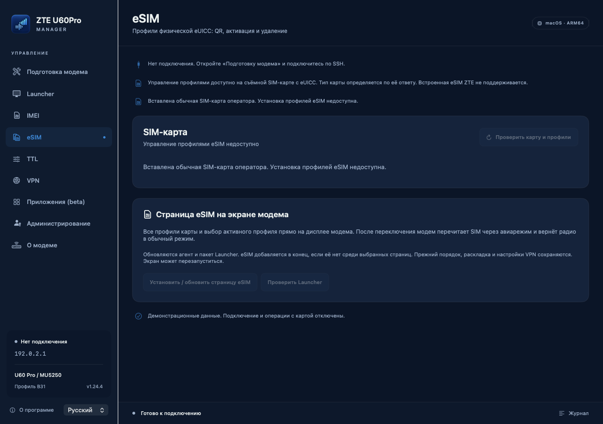
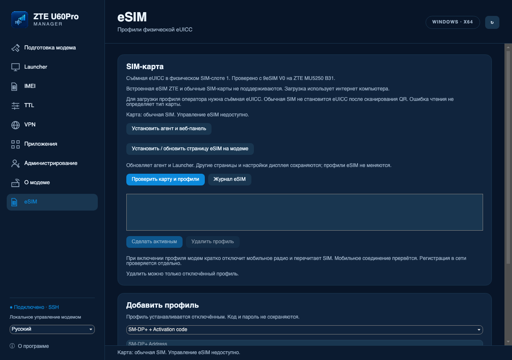

# 1.24.4 build 43: SIM и SSH

Кандидат: macOS **build 43**, Windows **FileVersion/AssemblyVersion 1.24.4.2**,
агент **2.9.0-esim.4**. GitHub-публикация этим циклом не выполнялась.

## Что изменилось

Обычное подключение и чтение сведений используют выбранный SSH с проверенным
ключом сервера. Установленный агент, пароль агента, CID, ARM64 и хэш B31
для такого чтения не требуются. Недоступные сведения остаются неизвестными.
Подготовка сначала проверяет уже работающий SSH, затем требования новой установки.
Чтение хэшей не обходит цепочку родительских каталогов.

Проверка SIM использует QMI для выбранного физического слота. Она открывает
собственный канал, выбирает ISD-R и закрывает канал. Ответ SELECT `6A82` при
готовой карте и подтверждённом закрытии даёт обычную SIM: snapshot отсутствует,
управление профилями недоступно. Другие ошибки оставляют тип неизвестным.
Для eUICC читаются EID и профили. Запись снова проверяет карту и список.

Чтение eSIM не требует IMEI, B31-хэша, lpac или сертификатов оператора.
lpac и HTTPS создаются по необходимости. Запуск ARM64-helper требует Linux
ARM64/root и доступного QMI UIM. Переключение с восстановлением радио пока
использует проверенный путь B31. Для профилей нужна съёмная физическая eUICC;
встроенная eSIM ZTE не поддерживается продуктом.

Блокировка карты — отдельный процессный flock, освобождаемый ядром при выходе.
Ошибка не создаёт постоянную общую блокировку модема. Конечные сроки ожидания
ответа сохраняются, чтобы потеря связи не оставляла операцию висеть.

## Проверка

| Область | Результат |
| --- | --- |
| Bridge / агент / VPN-controller | 67 / 156 / 21 тест PASS с новым embedded bridge |
| macOS eSIM | 27 тестов и 37 групп AppModel PASS |
| macOS SSH/подготовка/диагностика | 207 проверок PASS, включая настоящий `/bin/sh` с отсутствующим ubus и CID |
| Windows протокол / сервис eSIM / UI RU+EN | 234 / 22 / 8 групп PASS |
| Windows SSH/подготовка | 24 reuse + 39 discovery + 128 core + 5 сервисных групп PASS |
| Web / Launcher | 25 проверок, TypeScript/ESLint; C ASan/UBSan PASS |
| Новые сообщения RU/EN | 44 macOS + 26 Windows runtime-проверок PASS |
| Интерфейс macOS | 6 production SwiftUI экранов RU/EN отрисованы с синтетическими данными |
| Пакеты | macOS подпись, ZIP CRC, исходники и ресурсы; Windows PE x64, версия 1.24.4.2 и ресурсы — PASS |
| Каталоги | Старые ключи/значения сохранены; JSON macOS и 796 встроенных Windows-переводов совпадают с исходниками |

На подключённом модеме bridge завершил чтение за **0,20 с**. Два последовательных
чтения новым агентом — **0,24/0,23 с**, настоящим macOS EsimService — **1,74/1,71 с**.
Карта ответила как обычная SIM; владелец подтвердил обычную SIM оператора.
Каналы закрыты, snapshot не создан. Профили и радио не менялись,
постоянный агент не заменялся. Историческая общая блокировка завершённого eSIM
процесса сохранена в отдельном каталоге и больше не занимает рабочее имя.

9eSIM сейчас недоступна. После рефакторинга чтение настоящей eUICC и
загрузка/удаление/переключение профилей вживую не проверялись.
Нативный запуск на Windows и устройство SashaRIP не проверены;
Windows UI тестировался на macOS. Эти границы не заменяются синтетическими тестами.

## Интерфейс обычной SIM

Синтетические карты; macOS SwiftUI и Windows Avalonia на macOS.

| macOS | Windows UI |
| --- | --- |
|  |  |
